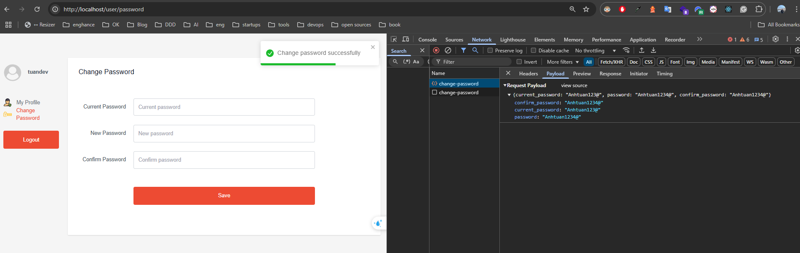
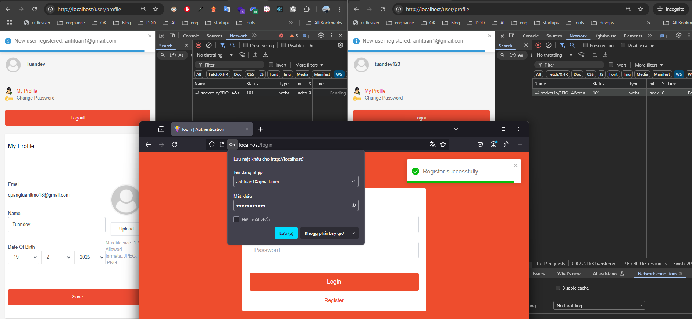

# Full-Stack Authentication Application

This project implements a full‑stack authentication application that includes basic, advanced, and optional challenging features. The client is built with React and served via Nginx on port 80, the server uses Node.js with Express on port 4000, and MongoDB (running on port 27017) is used for data storage. All components are containerized using Docker and orchestrated with Docker Compose.

---

## Table of Contents

- [Features](#features)
- [Tech Stack](#tech-stack)
- [Docker Setup and Deployment](#docker-setup-and-deployment)
- [Getting Started](#getting-started)
- [Environment Variables](#environment-variables)
- [Acknowledgements](#acknowledgements)

---

## Features

### Basic Features

- **Authentication:**

  - Render an authentication form at URL (`http://localhost/login`), users log in with their username and password. On successful login, the server returns an `access_token`, `refresh_token`, and user information. The tokens (`access_token` and `refresh_token`) are stored in the `localStorage`.
    - **access_token:** Used to access resources and APIs on the server.
    - **refresh_token:** Used to refresh the `access_token` when it expires; if the `refresh_token` also expires, the user is automatically logged out.
    <div align="center">
      
      <p  style="color: blue;">Login form</p>
    </div>
    <div align="center">
      
      <p  style="color: blue;"></p>
    </div>
  - On successful login, users are redirected to a protected profile page. The profile page (`http://localhost/user/profile`) is accessible only to authenticated users.
    <div align="center">
      
      <p  style="color: blue;">Profile page</p>
    </div>
  - User credentials are stored in MongoDB.
    <div align="center">
      
      <p  style="color: blue;">Database collections</p>
    </div>
    <div align="center">
      
      <p  style="color: blue;">Collection users</p>
    </div>
    <div align="center">
      
      <p  style="color: blue;">Collection refresh_tokens</p>
    </div>

### Advanced Features

- **Register Account:**
  - Users can register a new account via `http://localhost/register`. Each registered account has its own profile page, and data is respected to each account.
    <div align="center">
      
      <p  style="color: blue;">Register form</p>
    </div>
- **Password Management:**

  - Passwords are hashed.
  - The system includes logout and password change functionalities.
    <div align="center">
      
       
      <p  style="color: blue;">Change password</p>
    </div>

- **Profile Information Update:**
  - Users can update their personal information such as name, date of birthbirth, and avatar.
  <div align="center">
      
      <p  style="color: blue;">Update profile</p>
  </div>

### Challenging Features (Optional)

**Notifications:**

- Active users receive notifications via WebSockets when a new account is registered.
- **SocketIO Integration:**
  - Clients connect to the SocketIO server by providing an `access_token` during the connection handshake. This token is used to authenticate the user.
  - Once connected, the client listens for a `userRegistered` event.
- **Registration Flow:**
  - When a new user successfully registers, the server emits a `userRegistered` event to all connected clients.
  - Each active client catches the `userRegistered` event.
  - Upon receiving the event, the client displays a toast notification to inform the user that a new account has been registered.
   <div align="center">
    
    
      <p  style="color: blue;">Get notified when a new user registers</p>
  </div>

---

## Tech Stack

- **Client:** ReactJS, served with Nginx on port 80.
- **Server:** Node.js with Express, running on port 4000.
- **Database:** MongoDB, running on port 27017.
- **Containerization:** Docker and Docker Compose.

---

## Docker Setup and Deployment

This application is containerized using Docker and Docker Compose. The setup includes:

- **MongoDB:** Runs as a separate container with a named volume for data persistence.
- **Server:** The Node.js/Express server container connects to MongoDB using a connection URI that uses the service name (e.g., `db`) for hostname resolution.
- **Client:** The React application is built and then served via Nginx. The Nginx configuration uses a custom configuration file (`default.conf`) to support client-side routing (using the `try_files` directive).

To deploy the application, use the provided Docker Compose configuration (refer to the `docker-compose.yml` file in the repository).

---

## Getting Started

### Prerequisites

- Install [Docker](https://www.docker.com/get-started) and [Docker Compose](https://docs.docker.com/compose/install/).

### Steps

1. **Clone the Repository:**
   - Open your terminal and run:
     ```bash
     git clone https://github.com/quangtuanitmo18/Authentication-lab2-WAD.git
     cd Authentication-lab2-WAD
     ```
2. **Configure Environment Variables:**
   - In the `server` directory, create an environment file (e.g., `.env.development`) with all necessary configuration settings such as MongoDB connection details and JWT secrets.
   - In the `client` directory, create an environment file (e.g., `.env`)
3. **Build and Start the Containers:**

   - From the project root, run:

     ```bash
     docker-compose up -d
     ```

     <div align="center">

       
       <p  style="color: blue;">Docker compose</p>
     </div>

4. **Access the Application:**
   - **Client:** Open your browser and navigate to [http://localhost](http://localhost).
   - **Server API:** Accessible at [http://localhost:4000](http://localhost:4000).

---

## Acknowledgements

- [React](https://reactjs.org/)
- [Express](https://expressjs.com/)
- [MongoDB](https://www.mongodb.com/)
- [Docker](https://www.docker.com/)
- [Docker Compose](https://docs.docker.com/compose/)
- [SocketIO](https://socket.io/)
